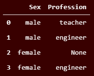
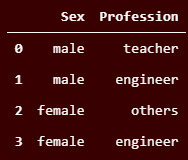
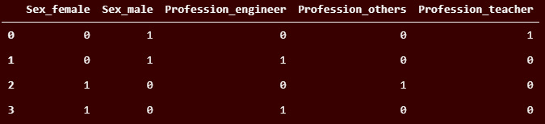

# Cupoy-Course-D11
[課程網址](https://www.cupoy.com/marathon-mission/00000174C4BC1B93000000016375706F795F70726572656C656173654355/00000176E0B0C273000000136375706F795F72656C656173654349/)  
Cupoy Python資料科學 課程作業 D11 pandas 類別資料與缺失值處理</br>

作業目標:<br>
1. 運用編碼處理類別資料<br>
2. 補缺失值  

作業重點:<br>
1. 類別編碼有多種方法，需分辨使用方法與時機<br>
2. 補缺失值須因應情境決定如何補值  

題目 :  
將以下問卷資料的職業(Profession)欄位缺失值填入字串'others'，更進一步將字串做編碼。  
此時用什麼方式做編碼比較適合?為什麼?  

```py
import pandas as pd
q_df = pd.DataFrame([['male', 'teacher'], 
              ['male', 'engineer'],
              ['female', None],
              ['female', 'engineer']],columns=['Sex','Profession'])
q_df
```

output:  


```py
#缺失值填入字串'others'
q_df=q_df.fillna('others')
q_df
```

output:  


```py
#更進一步將字串做編碼。 此時用什麼方式做編碼比較適合?為什麼?
#Ans:使用one-hot encoding, 因資料間無順序關係
q_df=pd.get_dummies(q_df)
q_df
```

output:  

