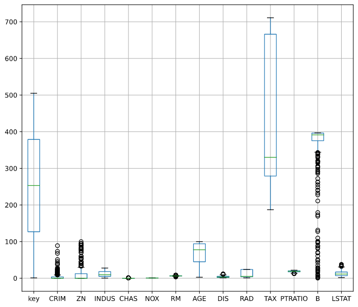
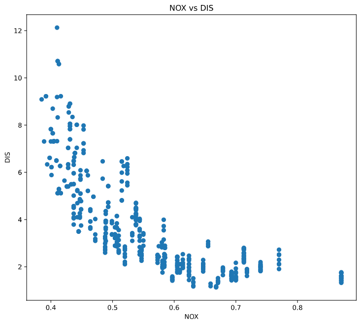

# Cupoy-Course-D12
[課程網址](https://www.cupoy.com/marathon-mission/00000174C4BC1B93000000016375706F795F70726572656C656173654355/00000176E0BA8B3C000000146375706F795F72656C656173654349/)  
Cupoy Python資料科學 課程作業 D12 pandas 常見圖表程式設計</br>

作業目標:<br>
1. 靈活運用圖表在各種情況下  
2. 圖表的解讀  

作業重點:<br>
1. 依據需求畫出圖表<br>
2. 在做圖表解釋時，須了解圖表中的含意  

題目 : 將資料夾中boston.csv讀進來，並用圖表分析欄位。<br>
1.畫出箱型圖，並判斷哪個欄位的中位數在300~400之間?<br>
2.畫出散佈圖 x='NOX', y='DIS' ，並說明這兩欄位有什麼關係?  

```py
import pandas as pd
import numpy as np
import matplotlib.pyplot as plt
boston_data=pd.read_csv('boston.csv')
```

```py
#1.畫出箱型圖，並判斷哪個欄位的中位數在300~400之間?
plt.figure(figsize=(9,8))
boston_data.boxplot()
#ANS: TAX & B 的中位數在300~400之間
```

output:


```py
#2. 畫出散佈圖 x='NOX', y='DIS' ，並說明這兩欄位有什麼關係?
plt.figure(figsize=(9,8))
plt.scatter(boston_data.NOX,boston_data.DIS)
plt.title("NOX vs DIS")
plt.xlabel("NOX")
plt.ylabel("DIS")
plt.show()
#ANS : 此兩欄位呈反比
```

output:

