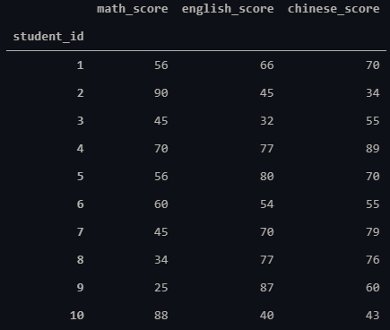

# Cupoy-Course-D13
[課程網址](https://www.cupoy.com/marathon-mission/00000174C4BC1B93000000016375706F795F70726572656C656173654355/00000176E0C53DFB000000156375706F795F72656C656173654349/)  
Cupoy Python資料科學 課程作業 D13 pandas 統計函式使用教學</br>

作業目標:<br>
1. 敘述統計量計算<br>
2. 運用自定義函數apply  

作業重點:<br>
1. 了解敘述統計量並解釋<br>
2. 運用apply時須注意自定義函數寫法  

題目<br>
對以下成績資料做分析<br>
1. 6號學生(student_id=6)3科平均分數為何?<br>
2. 6號學生3科平均分數是否有贏過班上一半的同學?<br>
3. 由於班上同學成績不好，所以學校統一加分，加分方式為開根號乘以十，請問6號同學3科成績分別是?<br>
4. 承上題，加分後各科班平均變多少?<br>
score_df = pd.DataFrame([[1,56,66,70],  
              [2,90,45,34],  
              [3,45,32,55],  
              [4,70,77,89],  
              [5,56,80,70],  
              [6,60,54,55],  
              [7,45,70,79],  
              [8,34,77,76],  
              [9,25,87,60],  
              [10,88,40,43]],columns=['student_id','math_score','english_score','chinese_score'])  

```py
import pandas as pd
score_df = pd.DataFrame([[1,56,66,70], 
              [2,90,45,34],
              [3,45,32,55],
              [4,70,77,89],
              [5,56,80,70],
              [6,60,54,55],
              [7,45,70,79],
              [8,34,77,76],
              [9,25,87,60],
              [10,88,40,43]],columns=['student_id','math_score','english_score','chinese_score'])
score_df = score_df.set_index('student_id')
score_df
```
output:  
  

```py
#1.6號學生(student_id=6)3科平均分數為何?
# score_df[5:6].mean(axis=1)[6]
score_df.loc[6].mean()
```

```
output:56.333333333333336
```

```py
#2. 6號學生3科平均分數是否有贏過班上一半的同學
s6_mean,class_mean_med=score_df.loc[6].mean(),score_df.mean(axis=1).median()
if s6_mean > class_mean_med:
    print("YES, 6號學生3科平均分數有超過班上一半同學\n6_average:{} class_average_med:{}".format(s6_mean,class_mean_med))
else:
    print("NO, 6號學生3科平均分數沒有超過班上一半同學\n6_average:{} class_average_med:{}".format(s6_mean,class_mean_med))
```

```
output:
    NO, 6號學生3科平均分數沒有超過班上一半同學
    6_average:56.333333333333336 class_average_med:59.833333333333336
```

```py
#由於班上同學成績不好，所以學校統一加分，加分方式為開根號乘以十，請問6號同學3科成績分別是?
add_score_df=score_df.apply(lambda x : x**0.5*10)
add_score_df.loc[6]#.round().astype(int)
```

```
output:
    math_score       77.459667
    english_score    73.484692
    chinese_score    74.161985
    Name: 6, dtype: float64
```

```py
#承上題，加分後各科班平均變多少
add_score_df.mean(axis=0)#.round().astype(int)
```

```
output:
    math_score       74.194221
    english_score    78.350301
    chinese_score    78.739928
    dtype: float64
```
