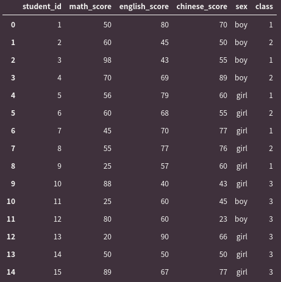
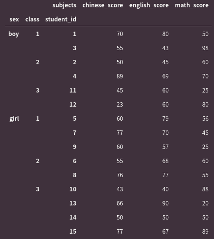

# Cupoy-Course-D14
[課程網址](https://www.cupoy.com/marathon-mission/00000174C4BC1B93000000016375706F795F70726572656C656173654355/00000176E0D6D95C000000176375706F795F72656C656173654349/)  
Cupoy Python資料科學 課程作業 D14 用 pandas 撰寫樞紐分析表</br>

作業目標:<br>
1. 熟悉索引與欄位設定  
2. 使用樞紐建立新資料  

作業重點:<br>
1. 多維度索引、欄位是有順序性的須注意  
2. 使用樞紐建立資料需要注意參數<br>
  index : 新資料的索引名稱<br>
  columns : 新資料的欄位名稱<br>
  values :新資料的值名稱  

題目: 運用下列分數資料重新建構資料，將索引(index)依序改為sex、class、student_id，欄位依序改成chinese_score、english_score、math_score<br><br>
score_df = pd.DataFrame([[1,50,80,70,'boy',1],[2,60,45,50,'boy',2],[3,98,43,55,'boy',1],[4,70,69,89,'boy',2],[5,56,79,60,'girl',1],[6,60,68,55,'girl',2],[7,45,70,77,'girl',1],[8,55,77,76,'girl',2],[9,25,57,60,'girl',1],[10,88,40,43,'girl',3],[11,25,60,45,'boy',3],[12,80,60,23,'boy',3],[13,20,90,66,'girl',3],[14,50,50,50,'girl',3],[15,89,67,77,'girl',3]],columns=['student_id','math_score','english_score','chinese_score','sex','class'])

```py
import pandas as pd
import numpy as np
score_df = pd.DataFrame([[1,50,80,70,'boy',1],[2,60,45,50,'boy',2],[3,98,43,55,'boy',1],[4,70,69,89,'boy',2],[5,56,79,60,'girl',1],[6,60,68,55,'girl',2],[7,45,70,77,'girl',1],[8,55,77,76,'girl',2],[9,25,57,60,'girl',1],[10,88,40,43,'girl',3],[11,25,60,45,'boy',3],[12,80,60,23,'boy',3],[13,20,90,66,'girl',3],[14,50,50,50,'girl',3],[15,89,67,77,'girl',3]],columns=['student_id','math_score','english_score','chinese_score','sex','class'])
score_df
```
output:  
  

```py
#將索引(index)依序改為sex、class、student_id，欄位依序改成chinese_score、english_score、math_score
score_df_1=score_df.melt(id_vars=['sex','class','student_id'],var_name='subjects',value_name='scores')
score_df_1.pivot(index=['sex','class','student_id'],columns=['subjects'],values='scores')
```

output:  
