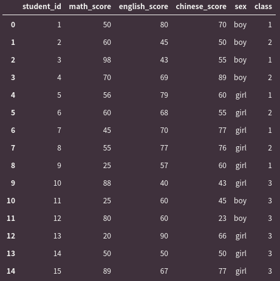

# Cupoy-Course-D15
[課程網址](https://www.cupoy.com/marathon-mission/00000174C4BC1B93000000016375706F795F70726572656C656173654355/00000176E0E79AFC000000186375706F795F72656C656173654349/)  
Cupoy Python資料科學 課程作業 D15 pandas Split-Apply-Combine Strategy</br>

作業目標:<br>
1. 熟悉分組計算  

作業重點: <br>
1. 分組計算也可以加入apply自定義的函數  

題目 : 運用下列分數資料分析<br>
1. 找出全年級各科成績最高分與最低分?<br>
2. 找出數學班平均最高的班級?<br>
3. 分析全校女生與男生國文平均差幾分?<br>
score_df = pd.DataFrame([[1,50,80,70,'boy',1],[2,60,45,50,'boy',2],[3,98,43,55,'boy',1],[4,70,69,89,'boy',2],[5,56,79,60,'girl',1],[6,60,68,55,'girl',2],[7,45,70,77,'girl',1],[8,55,77,76,'girl',2],[9,25,57,60,'girl',1],[10,88,40,43,'girl',3],[11,25,60,45,'boy',3],[12,80,60,23,'boy',3],[13,20,90,66,'girl',3],[14,50,50,50,'girl',3],[15,89,67,77,'girl',3]],columns=['student_id','math_score','english_score','chinese_score','sex','class'])

```py
import pandas as pd
score_df = pd.DataFrame([[1,50,80,70,'boy',1], 
              [2,60,45,50,'boy',2],
              [3,98,43,55,'boy',1],
              [4,70,69,89,'boy',2],
              [5,56,79,60,'girl',1],
              [6,60,68,55,'girl',2],
              [7,45,70,77,'girl',1],
              [8,55,77,76,'girl',2],
              [9,25,57,60,'girl',1],
              [10,88,40,43,'girl',3],
              [11,25,60,45,'boy',3],
              [12,80,60,23,'boy',3],
              [13,20,90,66,'girl',3],
              [14,50,50,50,'girl',3],
              [15,89,67,77,'girl',3]],columns=['student_id','math_score','english_score','chinese_score','sex','class'])
score_df
```
output:  
  

```py
#1.找出全年級各科成績最高分與最低分?
subject=['math_score','english_score','chinese_score']
score_df['school']=[1 for _ in range(len(score_df))]
max_score=score_df.groupby('school').max()
min_score=score_df.groupby('school').min()
for i in subject:
    print("{}-highest:{},lowest:{}".format(i,max_score[i][1],min_score[i][1]))
del score_df['school']
```
```
output:
  math_score-highest:98,lowest:20
  english_score-highest:90,lowest:40
  chinese_score-highest:89,lowest:23
```

```py
#2.找出數學班平均最高的班級?
print('數學班平均最高的班級為： {} 班'.format(score_df.groupby('class').mean().math_score.idxmax()))
```

```
output: 數學班平均最高的班級為： 2 班
```

```py
#3.分析全校女生與男生國文平均差幾分?
abs(score_df.groupby('sex').mean().loc['boy'].chinese_score - score_df.groupby('sex').mean().loc['girl'].chinese_score)
```

```
output:  7.333333333333329
```