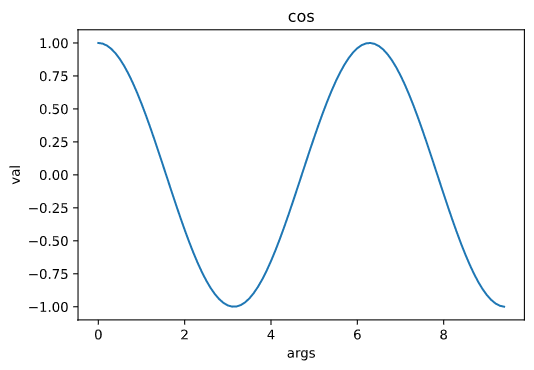

# Cupoy-Course-D18
[課程網址](https://www.cupoy.com/marathon-mission/00000174C4BC1B93000000016375706F795F70726572656C656173654355/00000176D6F42D75000000106375706F795F72656C656173654349/)  
Cupoy Python資料科學 課程作業 D18 Python 資料視覺化工具與常見統計圖表介紹</br>

# 教學目標 

主要說明matplotlib 的基礎操作  


# 範例重點

如何使用亂數, 資料集來操作  
 

題目 :   
1. 畫出完整的 cos 圖形</br>
2. 散點圖: Scatter Plots      
    顏色由（X，Y）的角度給出。  
    注意標記的大小，顏色和透明度。  
```py
# 載入需要的...
import matplotlib.pyplot as plt
import numpy as np
#畫出完整的 cos 圖形
'''
作業

'''
x = np.arange(0, 3 * np.pi, 0.1)
y_cos = np.cos(x)

plt.plot(x, y_cos)
plt.xlabel('args')
plt.ylabel('val')
plt.title('cos')
plt.show()
```
output:  
  
# 散點圖: Scatter Plots  
顏色由（X，Y）的角度給出。  
注意標記的大小，顏色和透明度。  
```py
n = 1024
X = np.random.normal(0,1,n)
Y = np.random.normal(0,1,n)
'''
#作業

#方法不只有一種

'''
plt.scatter(X,Y,c=np.arctan2(Y,X),alpha=0.4,s=70)
plt.xlim(-1.5,1.5)
plt.ylim(-1.5,1.5)


plt.show()

```
output:  
