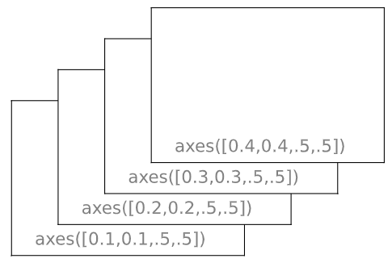
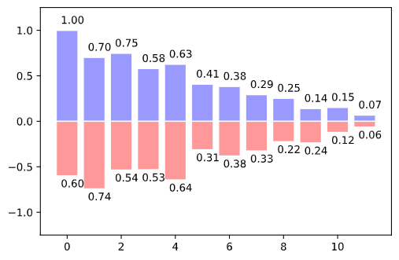

# Cupoy-Course-D19
[課程網址](https://www.cupoy.com/marathon-mission/00000174C4BC1B93000000016375706F795F70726572656C656173654355/00000176E11A55A90000001B6375706F795F72656C656173654349/)  
Cupoy Python資料科學 課程作業 D19 使用 Matplotlib 繪製各種常用圖表</br>

# 教學目標 

主要說明matplotlib 的基礎操作  

1. 使用常見的子圖與軸圖來做畫面配置  

2. 長條圖  

# 範例重點

如何使用亂數, 資料集來操作  


# 軸圖進階

但是可以將圖放置在圖中的任何位置。因此，如果要在較大的圖中放置較小的圖，則可以使用軸。  

#特別提醒: tick 刻度線定位器

格式正確的刻度線是準備發布的數據的重要組成部分。Matplotlib為滴答提供了一個完全可配置的系統。有刻度線定位器可以指定刻度線應出現的位置，刻度線格式化程序可以為刻度線提供所需的外觀。主刻度線和次刻度線可以相互獨立地定位和格式化。  

# 問題: 繪製如下圖示:

  
```py
import matplotlib.pyplot as plt

#決定底框
plt.axes([0.1,0.1,.5,.5])
#給定刻度
plt.xticks([]), plt.yticks([])
plt.text(0.1,0.1, 'axes([0.1,0.1,.5,.5])',ha='left',va='center',size=16,alpha=.5)


#決定第二層框
plt.axes([0.2,0.2,.5,.5])
#給定刻度
plt.xticks([]), plt.yticks([])
plt.text(0.1,0.1, 'axes([0.2,0.2,.5,.5])',ha='left',va='center',size=16,alpha=.5)

#決定第三層框
plt.axes([0.3,0.3,.5,.5])
#給定刻度
plt.xticks([]), plt.yticks([])
plt.text(0.1,0.1, 'axes([0.3,0.3,.5,.5])',ha='left',va='center',size=16,alpha=.5)

#決定第四層框
plt.axes([0.4,0.4,.5,.5])
#給定刻度
plt.xticks([]), plt.yticks([])
plt.text(0.1,0.1, 'axes([0.4,0.4,.5,.5])',ha='left',va='center',size=16,alpha=.5)

plt.show()
```

output:  


# 條型圖: Bar Plots
    
長條圖主要用來呈現兩個維度的資料，一個為X軸另一個則為Y軸(當然這邊指的是二維的狀況，較為常見)

主要用來呈現兩個維度的資料

# 問題: 嘗試通過添加紅色條形標籤重現右側的圖形。  


```py
import numpy as np
import matplotlib.pyplot as plt

 #配置12 組 Bar
n = 12 
X = np.arange(n)

 #給定數學運算式
Y1 = (1-X/float(n)) * np.random.uniform(0.5,1.0,n)
Y2 = (1-X/float(n)) * np.random.uniform(0.5,1.0,n)

#指定上半部繪製區域, 給定 Bar 顏色, 邊界顏色
plt.bar(X, +Y1, facecolor='#9999ff', edgecolor='white')
# +Y 指的是 XY 四象限的第一象限

'''
#指定上半部繪製區域, 給定 Bar 顏色, 邊界顏色
'''
plt.bar(X, -Y2, facecolor='#ff9999', edgecolor='white')
 #設定繪圖圖示區間
for x,y,y2 in zip(X,Y1,Y2):
    plt.text(x+0.2, y+0.05, '%.2f' % y, ha='center', va= 'bottom')
    plt.text(x+0.2, -y2-0.15, '%.2f' % y2, ha='center', va= 'bottom')
 #設定Y軸區間
plt.ylim(-1.25,+1.25)
plt.show()
```
output:  
