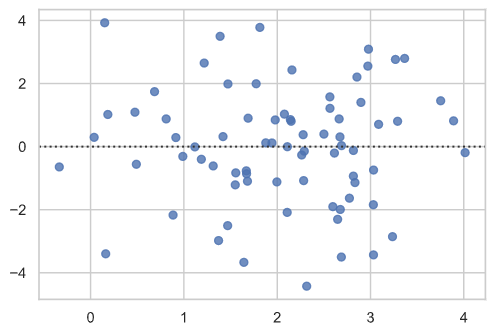
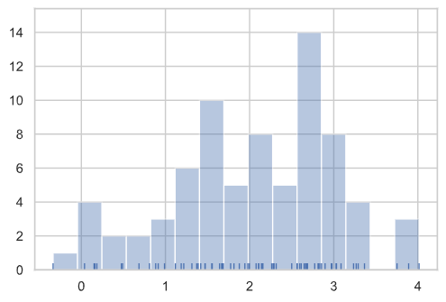
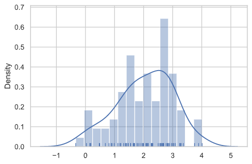

# Cupoy-Course-D20
[課程網址](https://www.cupoy.com/marathon-mission/00000174C4BC1B93000000016375706F795F70726572656C656173654355/0000017549731EBC000000256375706F795F72656C656173654349/)  
Cupoy Python資料科學 課程作業 D20 使用 Seaborn 進行資料視覺化</br>

**主要目標:**
    作業目標(1): 繪製模型殘差 圖型

更改初始值設定
溫馨叮嚀: 不熟悉使用沒關係, 提出來, 有專家陪跑


# Seaborn圖樣式
有五種預設seaborn主題：darkgrid，whitegrid，dark，white，和ticks。它們各自適合不同的應用和個人喜好。默認主題是darkgrid

```py
import numpy as np
import seaborn as sns

#設定圖形樣式 - whitegrid
# use sns.set
sns.set(style='whitegrid')

# 利用 NUMPY 去建立資料集
# np.random.RandomState 設定數學式
'''
x = rs.normal(2, 1, 75)
y = 2 + 1.5 * x + rs.normal(0, 2, 75)
'''
x=np.random.normal(2,1,75)
y= 2 + 1.5 * x + np.random.normal(0, 2, 75)
# 畫圖
# sns.residplot
sns.residplot(x=x,y=y)
```

output:  


繪製單變數分佈:  
快速檢視海出生單變數分佈的最便捷方式是distplot() 函數。默認情況下,這將繪製直方圖並適合內核密度估計值(KDE)。

作業目標(2)  
(1)使用 distplot()使用簡單的規則來正確猜測預設情況下正確的數位,但嘗試更多或更少的 bin 可能會顯示資料中的其他特徵:  
(2)有無kde對圖形分布的影響


```py
import pandas as pd
import matplotlib.pyplot as plt
from scipy import stats
# bin: 指的是特徵值, 
# kde: on/off
# sns.distplot();
sns.distplot(x, bins=15, kde=False, rug=True)

```
output:  


```py
sns.distplot(x, bins=15, kde=True, rug=True)
```
output:  
