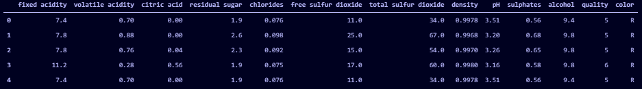
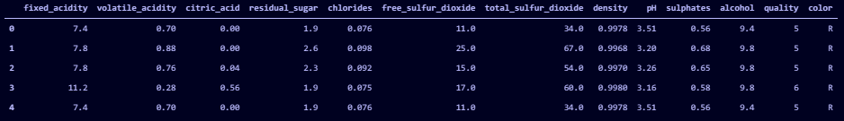
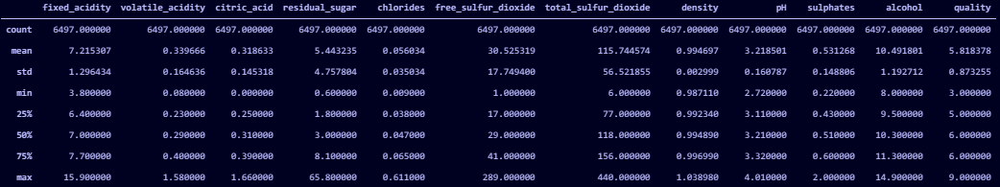
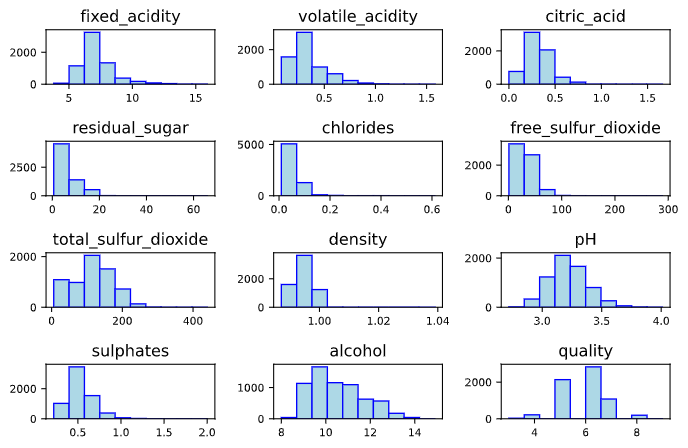
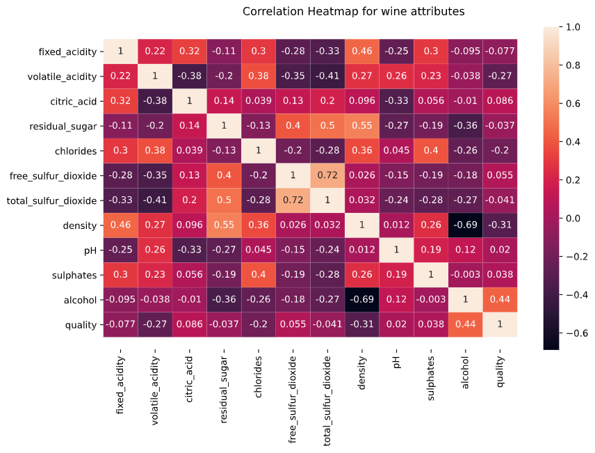
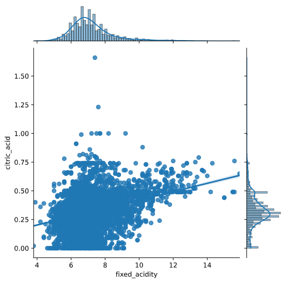
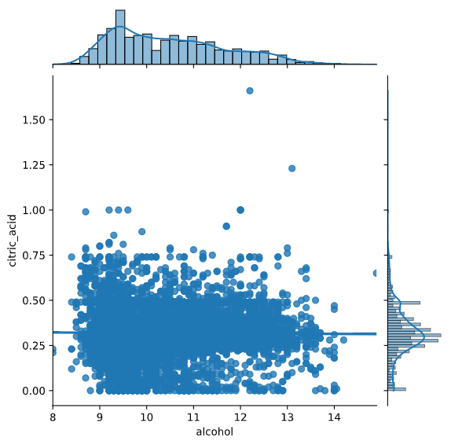
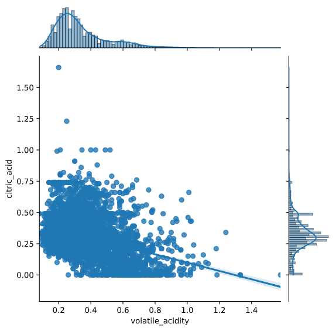
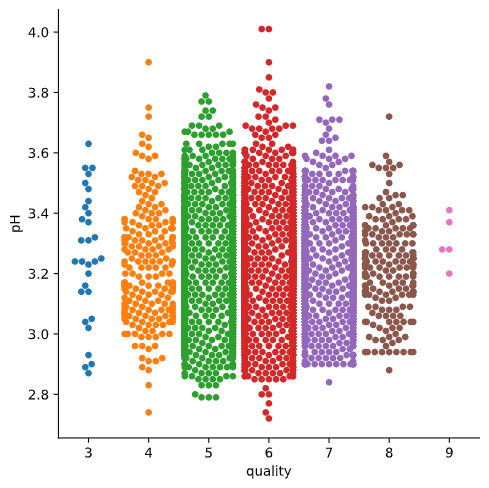
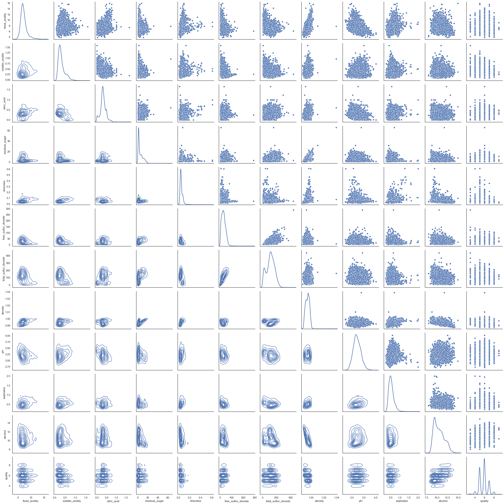

# Cupoy-Course-D22
[課程網址](https://www.cupoy.com/marathon-mission/00000174C4BC1B93000000016375706F795F70726572656C656173654355/000001754997FEB0000000276375706F795F72656C656173654349)  
Cupoy Python資料科學 課程作業 D22 結合 Pandas 與 Matploglib 進行進階資料視覺化練習</br>

目標: 了解利用 PANDAS 整理資料, 利用資料視覺化可以很快的判斷結果

重點: 資料整理與視覺化可以加速理解機器學習

作業: (1) 繪製 SWARM (2) 繪製 FaceGrid

```py
# 載入相關的程式庫
import pandas as pd
import numpy as np
import seaborn as sns
import matplotlib as mpl
import matplotlib.pyplot as plt
from mpl_toolkits.mplot3d import Axes3D
```

```py
### 利用 PANDAS 取得酒的品質資料 
df_red = pd.read_csv("winequality_red.csv")
df_white = pd.read_csv("winequality_white.csv")
```

```py
#資料整理
df_red["color"] = "R"
df_white["color"] = "W"

#整合紅酒與白酒的資料
df_all=pd.concat([df_red,df_white],axis=0)

# 檢查合併後的資料集
df_all.head()
```

output:  



```py
df_all.rename(columns={'fixed acidity': 'fixed_acidity','citric acid':'citric_acid',
                       'volatile acidity':'volatile_acidity','residual sugar':'residual_sugar',
                       'free sulfur dioxide':'free_sulfur_dioxide',
                       'total sulfur dioxide':'total_sulfur_dioxide'}, inplace=True)
# 檢查合併後的資料集
df_all.head()
```
output:  
   

```py
#處理缺失值
df = pd.get_dummies(df_all, columns=["color"])
df_all.isnull().sum()
```

```
output:  
    fixed_acidity           0
    volatile_acidity        0
    citric_acid             0
    residual_sugar          0
    chlorides               0
    free_sulfur_dioxide     0
    total_sulfur_dioxide    0
    density                 0
    pH                      0
    sulphates               0
    alcohol                 0
    quality                 0
    color                   0
    dtype: int64
```

```py
#可以使用 info() 方法瞭解有關資料集屬性的更多資訊。特別是行和列的數量、列名稱、它們的數據類型和空值數。
df_all.info()
```

```
output:  
    <class 'pandas.core.frame.DataFrame'>
    Int64Index: 6497 entries, 0 to 4897
    Data columns (total 13 columns):
    #   Column                Non-Null Count  Dtype  
    ---  ------                --------------  -----  
    0   fixed_acidity         6497 non-null   float64
    1   volatile_acidity      6497 non-null   float64
    2   citric_acid           6497 non-null   float64
    3   residual_sugar        6497 non-null   float64
    4   chlorides             6497 non-null   float64
    5   free_sulfur_dioxide   6497 non-null   float64
    6   total_sulfur_dioxide  6497 non-null   float64
    7   density               6497 non-null   float64
    8   pH                    6497 non-null   float64
    9   sulphates             6497 non-null   float64
    10  alcohol               6497 non-null   float64
    11  quality               6497 non-null   int64  
    12  color                 6497 non-null   object 
    dtypes: float64(11), int64(1), object(1)
    memory usage: 685.2+ KB
```

```py
#要瞭解數據集的統計摘要,即記錄數、平均值、標準差、最小值和最大值,我們使用描述()。
df_all.describe()
```
output:  


```py
#可視化所有數值數據。在垂直軸上計數,在水平軸上使用值範圍。hist 函數通過將所有屬性繪製在一起使操作變得簡單。
df_all.hist(bins=10, color='lightblue',edgecolor='blue',linewidth=1.0,
          xlabelsize=8, ylabelsize=8, grid=False)    

plt.tight_layout(rect=(0, 0, 1.2, 1.2))
```
output:  
  
  

熱圖是數據的二-D可視化,其中兩個要素之間的關係量級由色調表示。熱圖中的梯度根據屬性之間的相關性強度而變化。  
在下面的示例中,高度相關的屬性的陰影比其餘屬性暗。
```py
#Plotting heatmap
f, ax = plt.subplots(figsize=(10, 6))
b = sns.heatmap(df_all.corr(), annot=True, linewidths=.05, ax=ax)
f.subplots_adjust(top=0.93)
bottom, top = ax.get_ylim()
ax.set_ylim(bottom + 0.5, top - 0.5)
title= f.suptitle('Correlation Heatmap for wine attributes', fontsize=12)
```
output:  
  
  
聯合圖用於顯示兩個變數之間的關係。  
可以選擇從 5 個選項中繪製的繪圖種類 - 散點、reg、十六進位、kde、resid。  
下面展示了三個使用線性回歸線('reg'的例子)  
1. 第一個示例"檸檬酸"和"固定酸度"具有正相關關係,因此圖形是向上的。  
2. 然而,硫酸鹽和酒精的變數是相關的。因此,線性回歸線幾乎是平的。  
3. 具有"揮發性酸度"和"檸檬酸"屬性的示例具有負相關性,因此圖呈向下。  

```py
#Plotting Jointplot, 使用 'reg'== regression 回歸線繪製關係圖
a = sns.jointplot("fixed_acidity","citric_acid",data = df_all,kind ='reg', color = None)
b = sns.jointplot("alcohol", "citric_acid", data = df_all, kind = 'reg')
c = sns.jointplot("volatile_acidity", "citric_acid", data = df_all, kind = 'reg')
```
output:  
  
  
  

```py
'''
Swarm沿分類軸(質量)調整記錄。這種繪圖將記錄分別標記,而不會重疊。這就是為什麼它最適合小型數據集的原因。
在此圖表中,您可以看到硫酸鹽的數量,根據品質。品質值為 6 的硫酸鹽密度最高,品質等級為 9 和 3 的最低
'''
'''
#在此一區域寫下程式碼
使用sns.catplot
'''
g=sns.catplot(x='quality',y='pH',data=df_all,kind='swarm')
plt.show()
```
  

```py
'''
PairGrid 允許我們使用相同的繪圖類型繪製子圖網格來可視化數據。
與 FacetGrid 不同,它在每個子圖使用不同的變數對。它形成子圖的矩陣。它有時也被稱為"散點圖矩陣"。
對網格的用法與分面網格類似。首先初始化網格,然後傳遞繪圖函數。
'''
#在此一區域寫下程式碼
#設定底圖樣式
sns.set(style="white")
'''
#利用PairGrid 繪製對角圖
使用 sns.PairGrid
g.map_upper
g.map_lower
g.map_diag
'''
p=sns.PairGrid(df_all)
p.map_upper(sns.scatterplot)
p.map_lower(sns.kdeplot)
p.map_diag(sns.kdeplot)
```
  