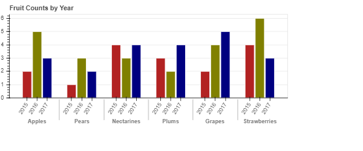
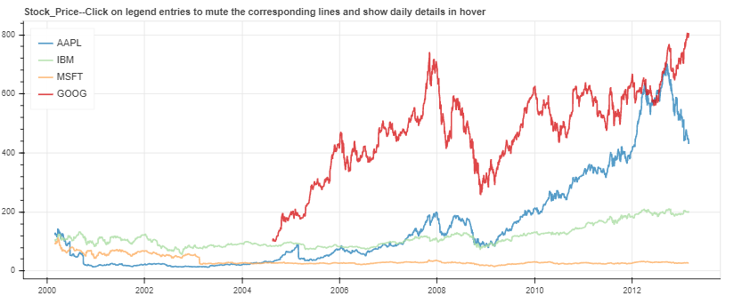

# Cupoy-Course-D23
[課程網址](https://www.cupoy.com/marathon-mission/00000174C4BC1B93000000016375706F795F70726572656C656173654355/0000017549AE520F000000286375706F795F72656C656173654349/)  
Cupoy Python資料科學 課程作業 D23 BOKEH - 輕鬆以網頁呈現視覺化圖表</br>

目標: 學習並了解Bokeh 如何應用  

重點:  

初步了解 BOKEH 互動式GUIDE LINE  
    
自定義和組織資料數據可視化  

為可視化添加交互姓 --- CustomJS/Render  

作業:  

1.建立簡單的水果資料集  
fruits = ['Apples', 'Pears', 'Nectarines', 'Plums', 'Grapes', 'Strawberries']  

counts = [5, 3, 4, 2, 4, 6]  

2. 利用 Source 建立字典, 再用figure 輸出 BAR 圖  
source = ColumnDataSource(data=dict(fruits=fruits, counts=counts, color=Spectral6))  

3. Bokeh官方有提供sample_data給大家練習，gallery豐富的範例都取自sample_data，對比官方的資料格式就能輕鬆模仿應用, 下載 股市資料  

4. 使用HoverTool(游標滑過時顯示資料); Click_policy (藉由標籤控制數值顯示)  
</br>
</br>

# 利用 Bokeh 與 Python 製作網頁互動視覺化
設定資料與輸出檔案 
output_file(“out.html”)  
利用 Bokeh 繪製圖表  
p = figure()  
p.line([1,2,3,4,5], [5,4,3,2,1])  
開啟產生的 HTML 檔 ( HTML + JavaScript ，自動生成 )  
show(p)  
```py
from bokeh.plotting import figure, output_file, show
from bokeh.models import widgets
from bokeh.io import output_notebook
import numpy as np


# 讓網頁直接輸出在NOTEBOOK
output_notebook()
```

  

```py
from bokeh.models import ColumnDataSource
from bokeh.palettes import Spectral6
from bokeh.models import ColumnDataSource, HoverTool
from bokeh.plotting import figure

fruits = ['Apples', 'Pears', 'Nectarines', 'Plums', 'Grapes', 'Strawberries']
counts = [5, 3, 4, 2, 4, 6]

source = ColumnDataSource(data=dict(fruits=fruits, counts=counts, color=Spectral6))

p = figure(x_range=fruits, plot_height=250, y_range=(0, 9), title="Fruit Counts")
p.vbar(x='fruits', top='counts', width=0.9, color='color', legend_field="fruits", source=source)

p.xgrid.grid_line_color = None
p.legend.orientation = "horizontal"
p.legend.location = "top_center"

show(p)
```
output:  
  

```py
from bokeh.models import FactorRange
from bokeh.transform import factor_cmap

fruits = ['Apples', 'Pears', 'Nectarines', 'Plums', 'Grapes', 'Strawberries']
years = ['2015', '2016', '2017']

data = {'fruits' : fruits,
        '2015'   : [2, 1, 4, 3, 2, 4],
        '2016'   : [5, 3, 3, 2, 4, 6],
        '2017'   : [3, 2, 4, 4, 5, 3]}

# this creates [ ("Apples", "2015"), ("Apples", "2016"), ("Apples", "2017"), ("Pears", "2015), ... ]
x = [ (fruit, year) for fruit in fruits for year in years ]
counts = sum(zip(data['2015'], data['2016'], data['2017']), ()) # like an hstack

source = ColumnDataSource(data=dict(x=x, counts=counts))

p = figure(x_range=FactorRange(*x), plot_height=250, title="Fruit Counts by Year")

#p.vbar(x='x', top='counts', width=0.9, source=source)

p.vbar(x='x', top='counts', width=0.9, source=source, line_color="white",

       # use the palette to colormap based on the the x[1:2] values
       fill_color=factor_cmap('x', palette=['firebrick', 'olive', 'navy'], factors=years, start=1, end=2))

p.y_range.start = 0
p.x_range.range_padding = 0.1
p.xaxis.major_label_orientation = 1
p.xgrid.grid_line_color = None

show(p)
```

output:  


```py
import bokeh.io
from bokeh.resources import INLINE
from bokeh.models import HoverTool
from bokeh.palettes import Spectral4
from bokeh.plotting import figure, output_file, show, output_notebook, ColumnDataSource
from bokeh.sampledata.stocks import AAPL, GOOG, IBM, MSFT
import pandas as pd

# 環境 settings
bokeh.io.reset_output()
bokeh.io.output_notebook(INLINE)


# set hover
## HoverTool
# 游標滑過時顯示資料,date格式需要轉換，不然會是timestamp
hover = HoverTool(
    tooltips = [
        ("date", "@date"),
        ("close", "@open"),
        ("close", "@close"),
        ("high", "@high"),
        ("low", "@low"),
        ("volume","@volume")
    ], 
    formatters={"@date":"datetime"}
)

# set figure
p = figure(
    plot_width=1000, 
    plot_height=400, 
    x_axis_type="datetime",
    tools=[hover,"pan,box_zoom,reset,save"],
)
p.title.text = 'Stock_Price--Click on legend entries to mute the corresponding lines and show daily details in hover'

# use ColumnDataSource to control
# click_policy
# 藉由標籤控制數值顯示
# hide為隱藏，mute為切換自訂顯示模式
# 可在muted_color控制顏色, muted_alpha控制顏色濃淡

for data, name, color in zip([AAPL, IBM, MSFT, GOOG], ["AAPL", "IBM", "MSFT", "GOOG"], Spectral4):
    df = pd.DataFrame(data)
    df['date'] = pd.to_datetime(df['date'])
    source = ColumnDataSource(df)
    p.line(x="date",y="close", line_width=2, color=color, alpha=0.8,
           muted_color=color, muted_alpha=0.2, legend_label=name,source=source)


p.legend.location = "top_left"
# use hide or mute
p.legend.click_policy="mute"

# output_file("interactive_legend.html", title="interactive_legend.py example")

show(p)
output_notebook() 
```
output:  


<!--```py
#使用pd.crosstab函數繪製交叉表，交叉表可以很直觀的依據艙位等級及性別來查看存活人數及死亡人數。
#繪製堆疊條形圖，x軸代表依據艙等分成男性及女性，y軸代表人數，其中藍色代表死亡人數，橘色代表存活人數。
survived_counts = pd.crosstab([df.pclass, df.sex],df.survived)
survived_counts 
```
output:  


```py
'''
在這邊coding
使用survived_counts.plot做對照組
'''
survived_counts.plot(kind='bar',stacked=True)
```
output:  


```py
# 直接使用PANDAS dataframe, 當作參數
#條形圖()顯示分類變數和連續變數之間的關係。數據以矩形條表示,其中條的長度表示該類別中數據的比例。

'''
在這邊coding
sns.violinplot
'''
sns.violinplot(data=survived_counts)
```
output:  


```py
# 瞭解性別在各艙等的分布的存活率
'''
在這邊coding
g = sns.FacetGrid
g.map
h = sns.FacetGrid
h.map
'''
# PS: 跟第一次做 Face.Grid 有何不同??
g = sns.FacetGrid(df, col = "survived")
g.map(plt.hist,"pclass")
plt.show()

h = sns.FacetGrid(df, col = "survived")
h.map(plt.hist,"sex")
plt.show()
```
output:  

--!>