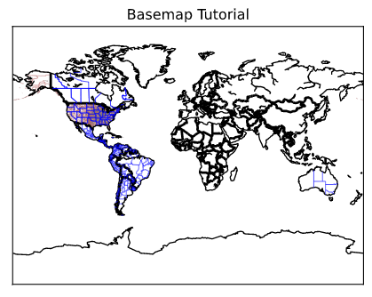

# Cupoy-Course-D24
[課程網址](https://www.cupoy.com/marathon-mission/00000174C4BC1B93000000016375706F795F70726572656C656173654355/0000017549F55675000000296375706F795F72656C656173654349/)  
Cupoy Python資料科學 課程作業 D24 Basemap 進行地理資訊繪圖</br>

# 目標: 
 
 安裝Basemap, 並且可以使用它繪製地理資訊. 這個教程中，我們將涉及地理繪圖module: Basemap。Basemap是Matplotlib的擴展.

# 重點:
 Basemap 在地圖集上的擴展應用
 

# 作業:

 1. 更改 Projection 的設定繪製出地球儀圖形  
 
    當 "projection" 參數為“ortho"時，所得圖位地球儀截面  
   
    當 "projection" 參數為“Mill"時，所得平展位面  
 
 
 2. 查看 resolution / 經緯度座標的繪圖精細度  
 
 

```py
# 載入套件
from mpl_toolkits.basemap import Basemap
import matplotlib.pyplot as plt
import numpy as np
```

```py
# 創建基本地圖。
# 當 "projection" 參數為“ortho"時，所得圖位地球儀截面
#設定圖形大小
plt.figure(figsize=(5,5))

#設定投影型態
m=Basemap(projection='ortho',resolution=None,lat_0=50,lon_0=-100)

#設定圖形顏色, 選用NASA 寶石藍輸出 
m.bluemarble(scale=0.5)

#秀圖
plt.show()
```
output:  
  

```py
m = Basemap(projection='mill',
            llcrnrlat = -90,
            llcrnrlon = -180,
            urcrnrlat = 90,
            urcrnrlon = 180,
           resolution='c') # 成圖設定resolution 

#創建邊線
m.drawcoastlines()
#畫出國家，並使用線寬為2 的線條生成分界線。
m.drawcountries(linewidth=2)
#畫出州界
m.drawstates(color='b')
#畫出城市
m.drawcounties(color='darkred')

plt.title('Basemap Tutorial')
plt.show()

```

output:  


```py
#設置Lambert保形底圖。
#set resolution = None跳過邊界數據集的處理
# projection='lcc'

m = Basemap(width=12000000,height=9000000,projection='lcc',
            resolution=None,lat_1=45.,lat_2=55,lat_0=50,lon_0=-107.)

#選用NASA 寶石藍輸出 
m.bluemarble()

#秀圖
plt.show()
```
output:  


<!--```py
#使用pd.crosstab函數繪製交叉表，交叉表可以很直觀的依據艙位等級及性別來查看存活人數及死亡人數。
#繪製堆疊條形圖，x軸代表依據艙等分成男性及女性，y軸代表人數，其中藍色代表死亡人數，橘色代表存活人數。
survived_counts = pd.crosstab([df.pclass, df.sex],df.survived)
survived_counts 
```
output:  


```py
'''
在這邊coding
使用survived_counts.plot做對照組
'''
survived_counts.plot(kind='bar',stacked=True)
```
output:  


```py
# 直接使用PANDAS dataframe, 當作參數
#條形圖()顯示分類變數和連續變數之間的關係。數據以矩形條表示,其中條的長度表示該類別中數據的比例。

'''
在這邊coding
sns.violinplot
'''
sns.violinplot(data=survived_counts)
```
output:  


```py
# 瞭解性別在各艙等的分布的存活率
'''
在這邊coding
g = sns.FacetGrid
g.map
h = sns.FacetGrid
h.map
'''
# PS: 跟第一次做 Face.Grid 有何不同??
g = sns.FacetGrid(df, col = "survived")
g.map(plt.hist,"pclass")
plt.show()

h = sns.FacetGrid(df, col = "survived")
h.map(plt.hist,"sex")
plt.show()
```
output:  

-->