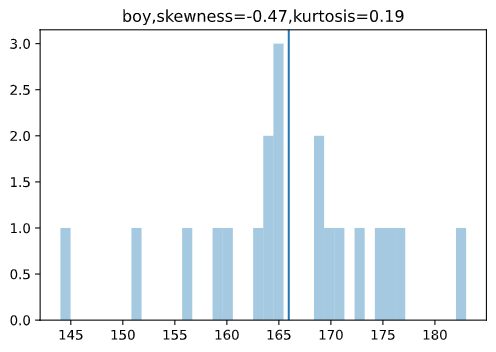
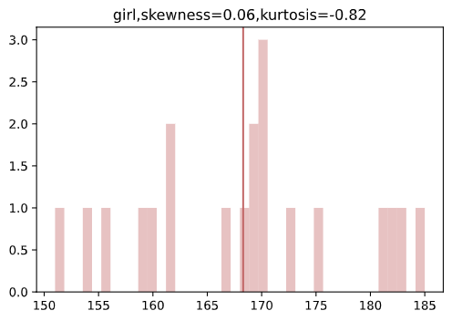
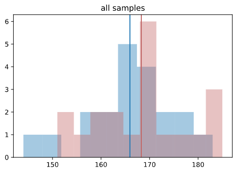

# Cupoy-Course-D26
[課程網址](https://www.cupoy.com/marathon-mission/00000174C4BC1B93000000016375706F795F70726572656C656173654355/000001754A4550E30000002C6375706F795F72656C656173654349/)  
Cupoy Python資料科學 課程作業 D26 用統計描述資料的樣態</br>

## 作業:
今天學到不同統計量之間特性，  
試著分析男生女生身高資料，  
試著回答下面的問題:  
Q1:試著用今天所教的內容，如何描述這兩組資料的樣態?    
Q2: 請問男生和女生在平均身高上誰比較高?   
Q3:請問第二題的答案和日常生活中觀察的一致嗎? 如果不一致，你覺得原因可能為何?    
上述問題透過  python 語法進行運算，
並將上述答案填寫在 (google 表單)[https://docs.google.com/forms/d/e/1FAIpQLSdDzwpeJl8YLPwZaW8pBZvtuXY9kIbbZLqxcXyzFaoraV5JEA/viewform]


##回答:
A1:
   1. 兩組資料型態的標準差很接近。
   2. 女生的平均身高較高。
   3. 男生的資料全距較大，也有較明顯的資料歪斜。
   4. 女生資料的全距很小，峰度也呈現低擴峰，資料分布較集中。  

A2:  
   女生
  
A3:  
   不相同，可能原因如下
   1. 抽樣不均，抽樣數太少，導致資料無法代表母體樣貌
   2. 資料來源不同，例如男女資料的來源為不同國家、人種、年齡、或抽樣時間。


```py
import matplotlib.pyplot as plt
import numpy as np
import pandas as pd
from scipy import stats
import math
import statistics
import seaborn as sns

boys=np.array([164, 176, 169, 169, 165, 175, 159, 151, 144, 160, 183, 165, 156, 170,
 164, 173, 165, 163, 177, 171])

girls=np.array([169, 183, 170, 168, 182, 170, 173, 185, 151, 156, 162, 169, 162, 181,
 159, 154, 167, 175, 170, 160])
```


```py
# 計算統計量_平均數的方法
mean_boy=np.mean(boys)
print("男孩身高平均=",mean_boy)
mean_girl=np.mean(girls)
print("女孩身高平均=",mean_girl)

# 計算統計量_中位數的方法
np_median_boy=np.median(boys,axis=None)
print("男孩身高中位數=",np_median_boy)
np_median_girl=np.median(girls,axis=None)
print("女孩身高中位數=",np_median_girl)

#計算統計量_眾數
mode_boy=stats.mode(boys,axis=None)
print("男孩身高眾數=",mode_boy[0][0])

mode_girl=stats.mode(girls,axis=None)
print("女孩身高眾數=",mode_girl[0][0])

#計算全距:
def rangeV(x): 
  return(max(x)-min(x))
    
print("男孩身高全距=",rangeV(boys))
print("女孩身高全距=",rangeV(girls))

#計算變異數
print("男孩身高變異數=",np.var(boys,ddof=1))
print("男孩身高變異數=",np.var(girls,ddof=1))


#計算標準差
std_boy=np.std(boys,ddof=1)
print("男孩身高標準差=",std_boy)
std_girl=np.std(girls,ddof=1)
print("女孩身高標準差=",std_girl)

## python 百分位數
#np
print("男孩身高90百分位數=",np.percentile(boys, 90))
print("男孩身高50百分位數=",np.percentile(boys, 50))
print("男孩身高20百分位數=",np.percentile(boys, 20))

print("女孩身高90百分位數=",np.percentile(girls, 90))
print("女孩身高50百分位數=",np.percentile(girls, 50))
print("女孩身高20百分位數=",np.percentile(girls, 20))


#計算峰度和偏度
print("男孩身高偏度=",stats.skew(boys))
print("男孩身高峰度=",stats.kurtosis(boys))

print("女孩身高偏度=",stats.skew(girls))
print("女孩身高峰度=",stats.kurtosis(girls))
```

output:  
```
男孩身高平均= 165.95
女孩身高平均= 168.3
男孩身高中位數= 165.0
女孩身高中位數= 169.0
男孩身高眾數= 165
女孩身高眾數= 170
男孩身高全距= 39
女孩身高全距= 34
男孩身高變異數= 84.89210526315789
男孩身高變異數= 95.37894736842104
男孩身高標準差= 9.213691185575838
女孩身高標準差= 9.766214587465353
男孩身高90百分位數= 176.1
男孩身高50百分位數= 165.0
男孩身高20百分位數= 159.8
女孩身高90百分位數= 182.1
女孩身高50百分位數= 169.0
女孩身高20百分位數= 159.8
男孩身高偏度= -0.4713212731737695
男孩身高峰度= 0.19395882957876331
女孩身高偏度= 0.059853211293650614
女孩身高峰度= -0.8203607083948943
```

  


```py
#最後，畫圖看分布
plt.hist(boys,alpha=.4,bins=40)
plt.title('boy,skewness={0},kurtosis={1}'.format(round(stats.skew(boys),2),round(stats.kurtosis(boys),2)))
plt.axvline(x=mean_boy)
plt.show()
```
output:  



```py
#最後，畫圖看分布
plt.hist(girls,alpha=.4,bins=40,color=sns.desaturate("indianred", .8))
plt.title('girl,skewness={0},kurtosis={1}'.format(round(stats.skew(girls),2),round(stats.kurtosis(girls),2)))
plt.axvline(x=mean_girl,color=sns.desaturate("indianred", .8))
plt.show()
```

output:  


```py
plt.hist(boys,alpha=.4)
plt.hist(girls,color=sns.desaturate("indianred", .8),alpha=.4)
plt.title("all samples")
plt.axvline(x=mean_girl,color=sns.desaturate("indianred", .8))
plt.axvline(x=mean_boy)
plt.show()
```

output:  


<!--```py
#使用pd.crosstab函數繪製交叉表，交叉表可以很直觀的依據艙位等級及性別來查看存活人數及死亡人數。
#繪製堆疊條形圖，x軸代表依據艙等分成男性及女性，y軸代表人數，其中藍色代表死亡人數，橘色代表存活人數。
survived_counts = pd.crosstab([df.pclass, df.sex],df.survived)
survived_counts 
```
output:  


```py
'''
在這邊coding
使用survived_counts.plot做對照組
'''
survived_counts.plot(kind='bar',stacked=True)
```
output:  


```py
# 直接使用PANDAS dataframe, 當作參數
#條形圖()顯示分類變數和連續變數之間的關係。數據以矩形條表示,其中條的長度表示該類別中數據的比例。

'''
在這邊coding
sns.violinplot
'''
sns.violinplot(data=survived_counts)
```
output:  


```py
# 瞭解性別在各艙等的分布的存活率
'''
在這邊coding
g = sns.FacetGrid
g.map
h = sns.FacetGrid
h.map
'''
# PS: 跟第一次做 Face.Grid 有何不同??
g = sns.FacetGrid(df, col = "survived")
g.map(plt.hist,"pclass")
plt.show()

h = sns.FacetGrid(df, col = "survived")
h.map(plt.hist,"sex")
plt.show()
```
output:  

-->